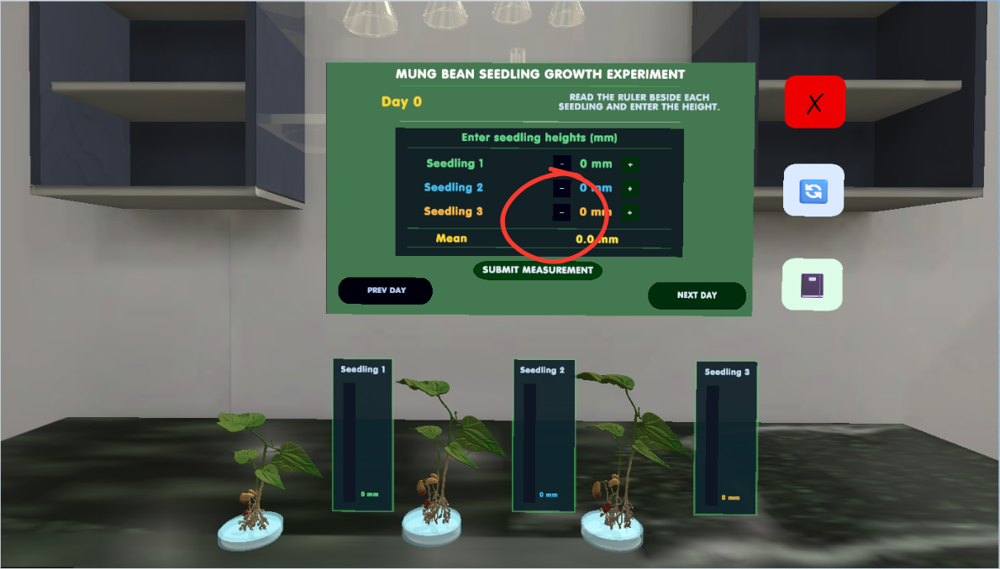
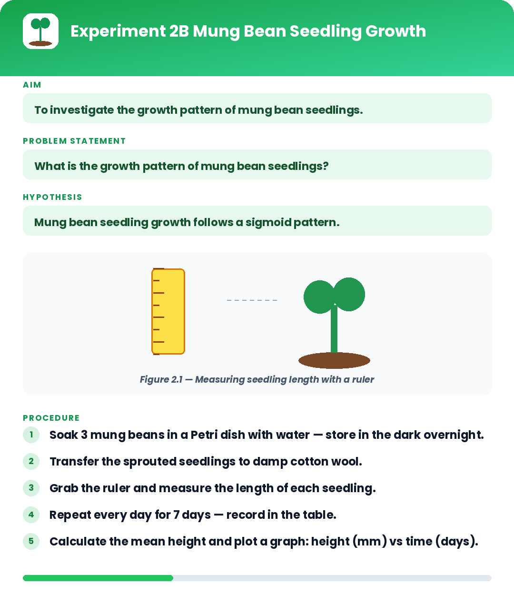
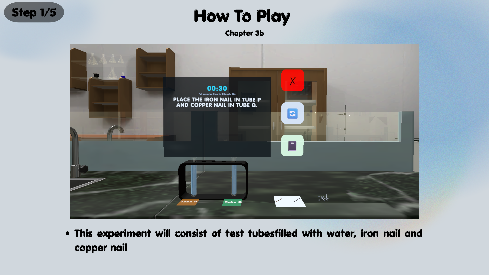
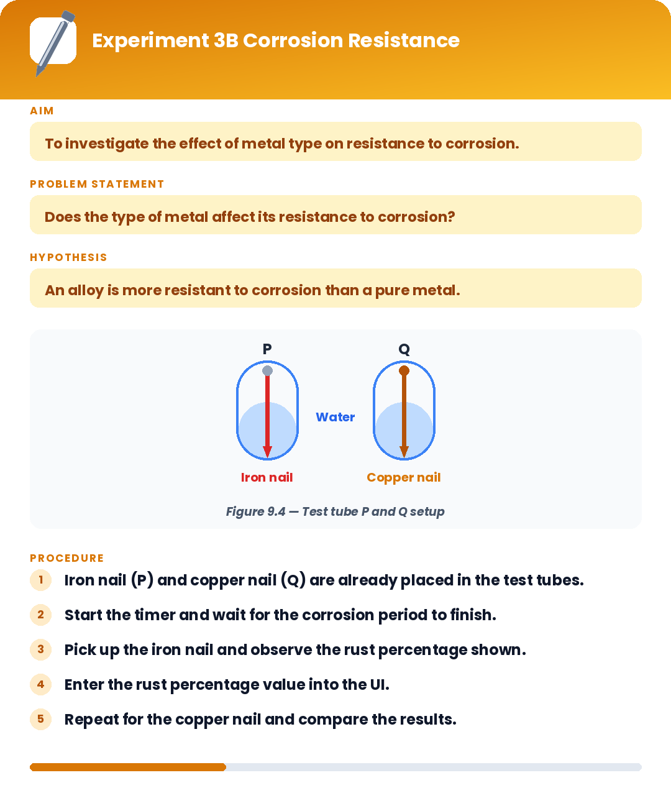

# SciLab VR

**SciLab VR** is a Unity-based virtual reality science laboratory project built around interactive, guided experiments. The project combines VR interaction, experiment logic, real-time validation, bilingual user interfaces, data recording, and visual feedback to turn science activities into structured immersive learning experiences.

## Project Overview

The repository contains systems developed for multiple experiment chapters and activities, including body-health measurements, plant growth and support, industrial chemistry, and physics/material experiments.

Rather than functioning as a passive virtual tour, the project is built around **hands-on experiment workflows**. Players interact with equipment and experiment objects, perform required actions, record observations or measurements, receive feedback, and progress through structured activities.

## Project Showcase

### Chapter 1 — Pulse & Health Experiments
Interactive activities explore pulse-rate measurement and changes associated with participant characteristics and physical activity, supported by guided experiment panels and runtime feedback.

<p align="center">
  
  
</p>

### Chapter 2 — Plant Growth Experiment
A guided VR experiment workflow supports observation and recording of seedling growth, combining physical interaction with experiment-specific UI and results.

<p align="center">
  
  
</p>

### Chapter 3 — Materials & Chemistry Experiments
Material-focused activities demonstrate additional interaction patterns, including corrosion and heat-related experiments, extending the same validation-driven VR learning framework across different laboratory scenarios.

<p align="center">
  
  
</p>

> The screenshots above are representative examples from the larger set of experiment activities. The portfolio intentionally highlights selected interactions rather than documenting every chapter screen.

## Key Systems

### Experiment & Chapter Management
The project contains dedicated managers and controllers for coordinating experiment states, progression, completion, retry flows, UI panels, and chapter-specific activities.

### Interactive Experiment Mechanics
Examples represented in the current codebase include:

- Pulse-rate measurement activities with timed sessions
- Haptic and visual pulse feedback
- Physics-based hardness/impact experiments
- Chemical dripping and laboratory interaction systems
- Measurement and ruler-based activities
- Test-tube, beaker, nail, rubber-strip, and placement interactions
- Experiment confirmation and validation workflows

### Virtual Science Notebook
A reusable notebook system records experiment results and organizes them by chapter and activity. It supports:

- Experiment entries and recorded results
- Pass/fail feedback
- Chapter completion states
- Multi-page content
- Star/progression feedback
- Runtime positioning in the VR environment

### Bilingual Interface
The project includes English and Bahasa Melayu UI flows across experiment instructions, status messages, navigation, confirmation panels, and notebook content.

### VR Feedback & Interaction
The codebase includes systems for:

- World-space UI placement
- Haptic feedback
- Visual feedback
- Object placement and sockets
- Physics interactions
- Audio feedback
- NPC activity/animation behaviour
- Interactive experiment controls

## Technical Highlights

- **Unity / C#**
- Virtual Reality interaction systems
- Physics-based experiment mechanics
- Runtime experiment validation
- State and progression management
- World-space UI
- TextMeshPro
- Haptic and visual feedback
- Persistent settings using PlayerPrefs
- Modular chapter and experiment controllers
- Data recording and result presentation

## Selected Code Areas

```text
SciLabVR/
├── 3a codes/
│   ├── Chapter1Manager.cs
│   ├── PulseSessionManager.cs
│   ├── PulseTarget.cs
│   ├── PulseHapticPlayer.cs
│   ├── PulseVisualIndicator.cs
│   └── NotebookRecorder.cs
├── Chapter 6/
│   ├── Chapter2AExperiment.cs
│   ├── Chapter2BExperiment.cs
│   ├── SimpleLineGraph.cs
│   └── VerticalRulerUI.cs
├── 9b/
│   ├── Chapter3AExperiment.cs
│   ├── Chapter3CExperiment.cs
│   ├── Chapter3DExperiment.cs
│   └── Chapter3Manager.cs
├── NotebookSystem.cs
├── NotebookPageData.cs
├── ConfirmationStation.cs
├── HardnessExperimentController.cs
├── PlacementSocket2A.cs
└── SettingsUI.cs
```

> The repository is currently being organized as a technical portfolio showcase. Folder names and selected source files may be cleaned up as the public presentation is refined.

## Development Focus

This repository demonstrates work across:

**Unity Development • C# Gameplay Systems • VR Interaction • Physics Simulation • Educational Technology • Experiment Validation • UI/UX Implementation • Data Recording • Haptic Feedback • Interactive Learning**

## Repository Note

This public repository contains selected code intended to demonstrate technical implementation and project architecture. Third-party assets and other restricted project materials are not included.
